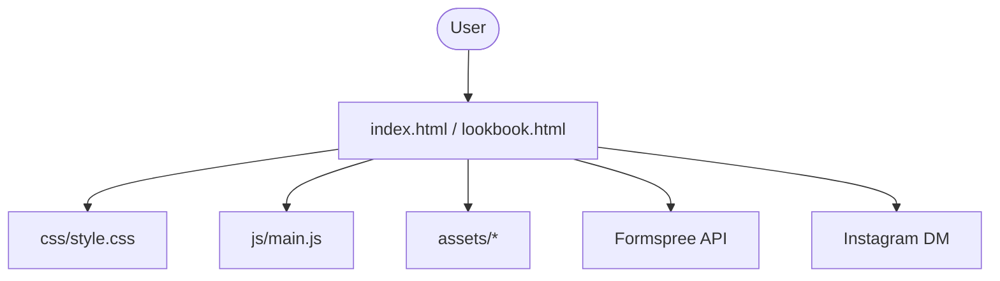

# 🏗️ 03. アーキテクチャ

## 🛠️ 技術スタック (Technical Stack)

本プロジェクトは、シンプルさとエレガントなビジュアルを両立させるため、以下の標準的な技術を採用しています。

- **Frontend**:
  - **HTML5**: セマンティックなマークアップ。
  - **CSS3 (Vanilla)**: 独自のデザインガイドラインに基づいたスタイリング。外部ライブラリ（Bootstrap 等）は使用していません。
  - **JavaScript (Vanilla)**: アニメーション、スクロール制御、フォーム処理を実装。
- **Assets**:
  - **WebP/JPEG/PNG**: パフォーマンスに最適化された画像素材。
- **Infrastructure**:
  - **Vercel**: 高速な配信と自動デプロイメント環境。

## 📐 システム構成

## 🎨 フロントエンドの構造

### 1. セマンティック・マークアップ

- `header`, `main`, `section`, `footer` タグによる適切な階層構造。

### 2. デザイン・システム

- **Typography**: Google Fonts (Cormorant Garamond, Noto Serif JP 等) を使用し、優雅さと可読性を両立。
- **Effects**: Intersection Observer API を活用した、スクロール時のフェードインアニメーション。

### 3. デバイス対応 (Responsive)

- メディアクエリによるレスポンシブデザイン。
- モバイル専用の CTA ボタンやナビゲーションメニューの実装。

詳細は [リポジトリ構造](./04-リポジトリ構造.md) を参照してください。
